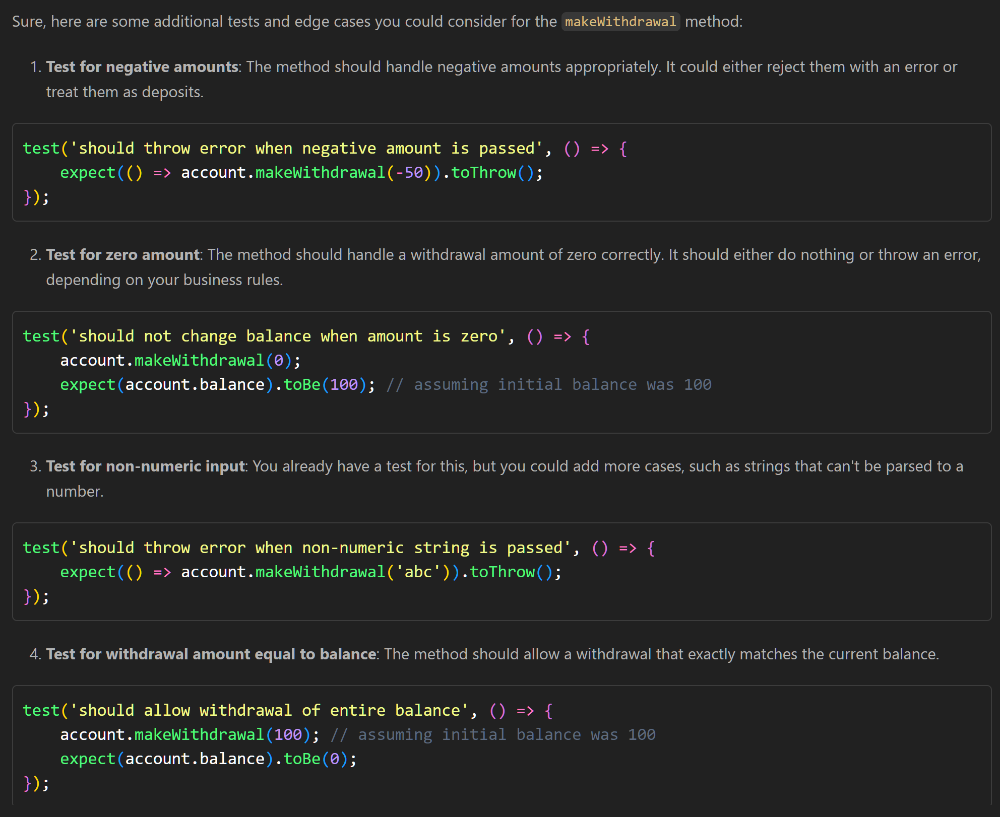
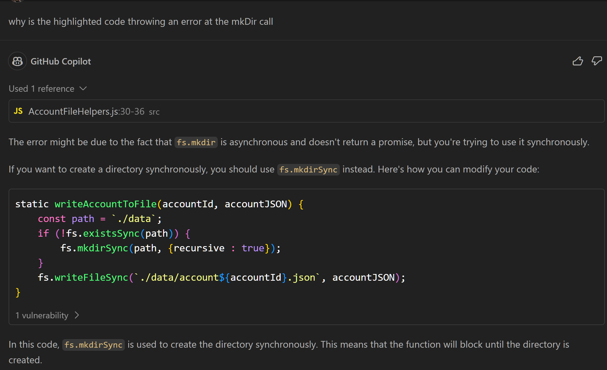

# Use of Generative AI within this challenge

I used Copilot to suggest edge test cases for the makeWithdrawal function of the Account class.

I wrote the following code based on the results from Copilot:

I also used it to determine why I was getting an error in a function I thought I had written correctly based on example code:

